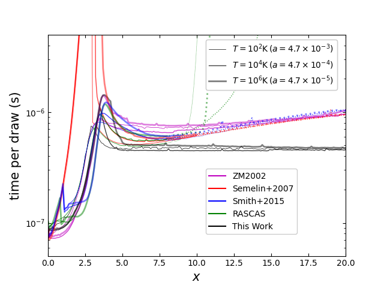
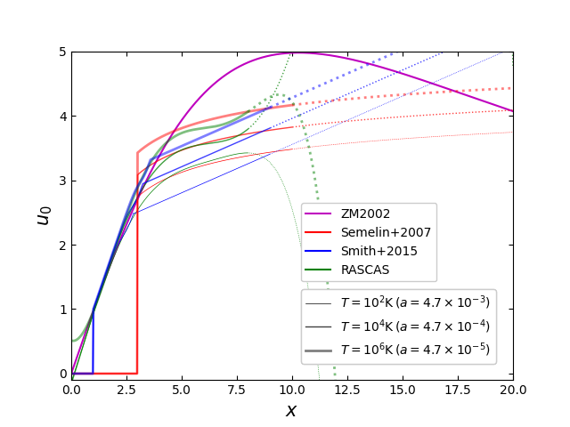

# Code for sampling the distribution of atomic velocity along the photon direction used in Lyman-alpha radiative transfer

The C code provides the implementation of the method in the Appendix A of [Li & Zheng (2026)](https://arxiv.org/abs/2606.27423) (LZ26) to sample the velocity distribution of Hydrogen atoms along the propagration direction of a Lyman-alpha photon, a key component in Monte Carlo simulations of Lyman-alpha radiative transfer. For comparison purpose, it also includes methods found in literature, such as [Zheng & Miralda-Escude (2002)](https://ui.adsabs.harvard.edu/abs/2002ApJ...578...33Z), [Semelin et al. (2007)](https://ui.adsabs.harvard.edu/abs/2007A%26A...474..365S), [Smith et al. (2015)](https://ui.adsabs.harvard.edu/abs/2015MNRAS.449.4336S), and [Michel-Dansac et al. (2020)](https://ui.adsabs.harvard.edu/abs/2020A%26A...635A.154M) (RASCAS). The distribution follows

$$
f(u) \propto \frac{e^{-u^2}}{(x-u)^2+a^2},
$$

where $u$ is in units of the thermal velocity $b=\sqrt{2k_{\rm B}T/m_{\rm H}}$, $a=4.7\times 10^{-4}(T/10^4 {\rm K})^{-1/2}$ is half of the Ly $\alpha$ natural line width in frequency and $x$ is the Ly $\alpha$ line frequency shift, both in units of the Doppler frequency width $\Delta\nu_{\rm D}=\nu_\alpha b/c$ (with $\nu_\alpha$ the line center frequency of Ly $\alpha$). 

The basic random number generator for random deviates uniformly distributed in [0,1) is based on the Mersenne Twister method, implemented in the GNU Scientific Library (GSL). You can replace it with your favorite one.

## Source files and the test code

The various methods to produce the velcoity distribution are in `src/random.c`. We provide a code to test the runtimes of those methods, `src/uztest.c`.

To compile, in `src/` run

```
make uztest
```

or

```
gcc -lm -o uztest uztest.c random.c
```

Running the code without arguments gives the usage of the code.
```
uztest 
run time test for drawing uz
Usage: src/uztest -seed option T
   seed   - random seed
   option - 0: ZM02
            1: LZ26 (optimized)
            2: Semelin2007
            3: RASCAS2020
            4: Smith2015
   T      - Temperature (K)
```
Here is an example of running the code.
```
uztest -1 1 1e4 > runtime1_T4.dat  
```
It calculates the runtime of drawing the velocity distribution for $T = 10^4$ K using the method in LZ26 (option 1) as a function of photon frequency shift $x$. It is based on $10^6$ draws for each $x$, and the results are saved in `runtime1_T4.dat`.

In `plots_LZ26/`, Python scripts and data are provided to reproduce the two panels of Fig.A2 in LZ26.



## Author

Zheng Zheng

## Citations

If you adopt any subroutine related to the implementation of the method in the Appendix A of [Li & Zheng (2026)](https://arxiv.org/abs/2606.27423), please cite the paper accordingly.

## License

The code is licensed under the MIT License.
